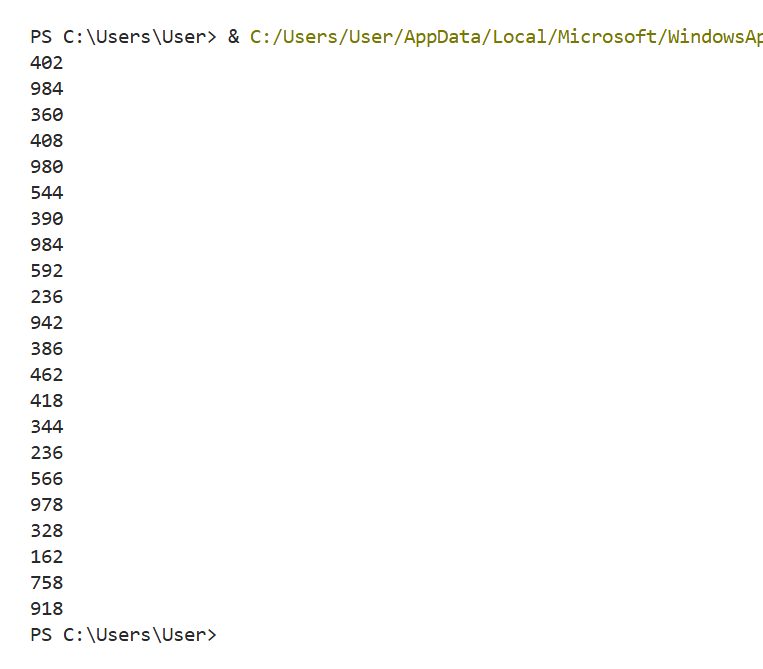

# Лабораторна робота №3
## З дисципліни «Об’єктно-орієнтоване програмування»

**Тема:** «Основи структурного програмування в Python 3»

**Виконала:** студентка групи КН-31з
Рибка Л.Г.

**Перевірив:** Татомир А.В.

Львів 2025

---

## Мета
Ознайомитися з основними прийомами структурного програмування у Python 3, зокрема з операторами циклів (`for`) та умовними операторами (`if`).

## Завдання
1.  Створити програму, що використовує цикл `for` для ітерації по колекції (списку).
2.  Використати умовний оператор `if` для фільтрації даних (перевірка на парність).
3.  Застосувати оператор модифікації циклу (`break`) для дострокової зупинки ітерації за певною умовою.

---

## Хід роботи

1.  Створено програму мовою Python 3 та оголошено список `numbers`.
2.  Реалізовано цикл `for`, що ітерує по елементах списку.
3.  Всередині циклу додано дві перевірки:
    * Оператор `if number == 237: break` зупиняє цикл, якщо поточний елемент дорівнює 237.
    * Оператор `if number % 2 == 0: print(number)` виводить число у консоль, тільки якщо воно є парним.
4.  Програма виводить всі парні числа зі списку до того, як зустріне число 237.
5.  Код розміщено у файлі `lb3.py`, а результат (скріншот консолі) — у `result.png`.

### 1) Код програми
[Переглянути код](./lb3.py)

### 2) РезультаT

---

## Висновки

Під час виконання цієї лабораторної роботи я засвоїла використання ключових конструкцій структурного програмування в Python 3.

Я навчив(ла)ся:
* Ітерувати по елементах списку за допомогою циклу `for`.
* Використовувати умовний оператор `if` та оператор (`%`) для перевірки парності чисел.
* Керувати виконанням циклу за допомогою оператора `break`, що дозволяє достроково перервати його роботу.