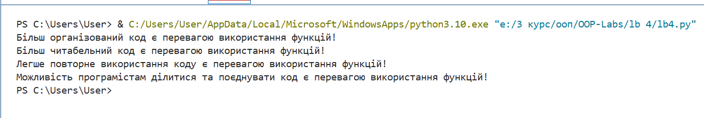

# Лабораторна робота №4
## З дисципліни «Об’єктно-орієнтоване програмування»

[cite_start]**Тема:** «Основи процедурного програмування в Python 3» 

**Виконала:** студентка групи КН-31з
Рибка Л.Г.

**Перевірив:** Татомир А.В.

Львів 2025

---

## Мета
[cite_start]Засвоєння методів та прийомів роботи з функціями. 

## Завдання
[cite_start]Вправа з розділу "Functions" на learnpython.org[cite: 13].

**Умова:** Написати функцію `list_benefits()`, яка повертає список переваг функцій. Написати функцію `build_sentence(benefit)`, яка приймає один аргумент і повертає речення. [cite: 14] [cite_start]Потім об'єднати їх роботу, щоб вивести на екран всі переваги у вигляді речень. [cite: 15]

---

## Хід роботи

### 1) Код програми
[Переглянути код](./lb4.py)

### 2) Результат

---

## Висновки
У ході виконання лабораторної роботи було закріплено навички створення та використання функцій у Python. Реалізовано програму, яка обробляє список і формує зрозумілий вивід результатів. Також отримано практичний досвід роботи з Git та GitHub для збереження та публікації коду.