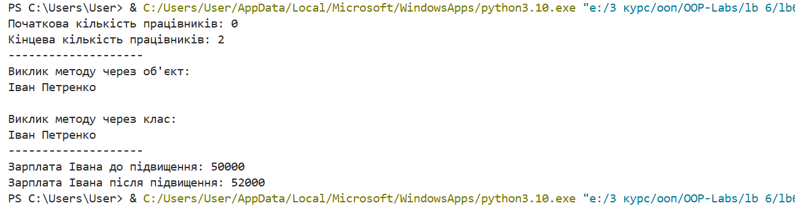

# Лабораторна робота №6
## З дисципліни «Об’єктно-орієнтоване програмування»

**Тема:** «Змінні класу та об’єкта»

**Виконала:** студентка групи КН-31з
Рибка Л.Г.

**Перевірив:** Татомир А.В.

Львів 2025

---

## Мета
Ознайомитися з різними типами змінних в об'єктно-орієнтованому програмуванні.

## Завдання
1.  Створити клас `Employee`.
2.  Реалізувати в класі **змінні класу**: `raise_amount` (коефіцієнт підвищення) та `num_of_employees` (лічильник об'єктів).
3.  Реалізувати **змінні об'єкта** (`first_name`, `last_name`, `pay`) в конструкторі `__init__`.
4.  В конструкторі реалізувати інкремент лічильника `num_of_employees`.
5.  Створити метод `apply_raise`, який використовує змінну класу `raise_amount`.
6.  Перевірити роботу лічильника та методів.

---

## Хід роботи

### 1) Код програми
[Переглянути код](./lb6.py)

### 2) Результат

---

## Висновки
Під час виконання лабораторної роботи було досягнуто поставленої мети: я ознайомилася з концепцією змінних класу та змінних об'єкта і закріпила їх практичне застосування в Python. На прикладі класу Employee було реалізовано спільні для всіх об'єктів дані (`raise_amount`) та лічильник екземплярів (`num_of_employees`). Це дозволило чітко розмежувати дані, що належать класу, від унікальних даних кожного об'єкта. Також було закріплено навички роботи з Git та GitHub для керування версіями коду.