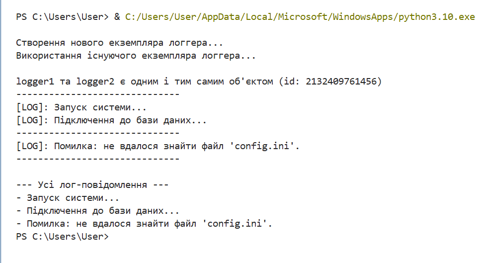

# Лабораторна робота №10
## З дисципліни «Об’єктно-орієнтоване програмування»

**Тема:** «Твірні шаблони проєктування»

**Виконала:** студентка групи КН-31з
Рибка Л.Г.

**Перевірив:** Татомир А.В.

Львів 2025

---

## Мета
Познайомитися з групою твірних шаблонів проєктування, засвоїти їх призначення та принципи роботи.

## Завдання
1.  Дати теоретичний опис твірної групи шаблонів.
2.  Реалізувати один із твірних шаблонів (наприклад, Singleton) мовою Python.
3.  Навести приклад коду, який демонструє роботу реалізованого шаблону.

---

## Хід роботи

### 1) Код програми
[Переглянути код](./lb10.py)

### 2) Результат

---

## Висновки
Під час виконання цієї лабораторної роботи я ознайомилася з концепцією твірних шаблонів проєктування, які вирішують задачі, пов'язані зі створенням об'єктів.

Я реалізувала шаблон **Singleton (Одинак)**, який гарантує, що клас має лише один екземпляр, та надає глобальну точку доступу до нього. Це було досягнуто шляхом перевизначення методу `__new__`, який контролює процес створення об'єкта. Робота шаблону була перевірена шляхом порівняння `id()` двох "створених" об'єктів, що підтвердило їх ідентичність.