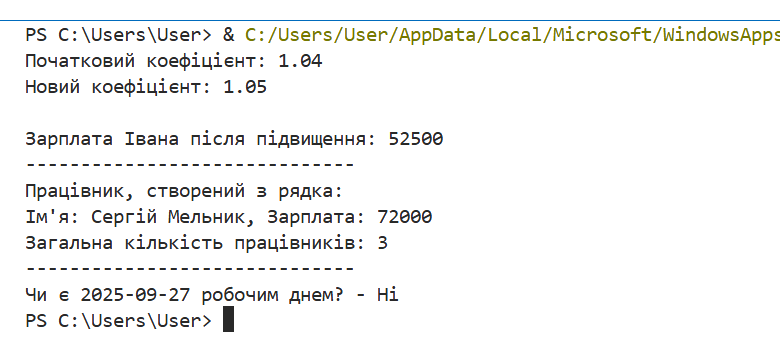

# Лабораторна робота №7
## З дисципліни «Об’єктно-орієнтоване програмування»

**Тема:** «Використання методів класу і статичних методів»

**Виконала:** студентка групи КН-31з
Рибка Л.Г.

**Перевірив:** Татомир А.В.

Львів 2025

---

## Мета
Ознайомитися з різними типами методів в об'єктно-орієнтованому програмуванні, засвоїти різницю між звичайними методами, методами класу та статичними методами, а також навчитися створювати альтернативні конструктори.

## Завдання
1.  На основі класу `Employee` реалізувати метод класу `set_raise_amount` (@classmethod), що працює зі змінною класу.
2.  Реалізувати альтернативний конструктор `from_string` за допомогою методу класу для створення об'єктів з текстового рядка.
3.  Реалізувати статичний метод `is_workday` (@staticmethod) для виконання допоміжної функції, логічно пов'язаної з класом.
4.  Перевірити роботу всіх реалізованих методів.

---

## Хід роботи

### 1) Код програми
[Переглянути код](./lb7.py)

### 2) Результат

---

## Висновки
Під час виконання лабораторної роботи було досягнуто поставленої мети: я ознайомилася з концепціями методів класу та статичних методів в Python, а також закріпила навички їх практичного застосування.

Я навчилася використовувати декоратори `@classmethod` та `@staticmethod`, зрозуміла різницю між ними та звичайними методами екземпляра. Було реалізовано метод класу для роботи зі змінними класу та створено альтернативний конструктор. Також було реалізовано статичний метод для виконання логічно пов'язаної з класом функції. Робота закріпила навички використання Git для версійного контролю коду.

