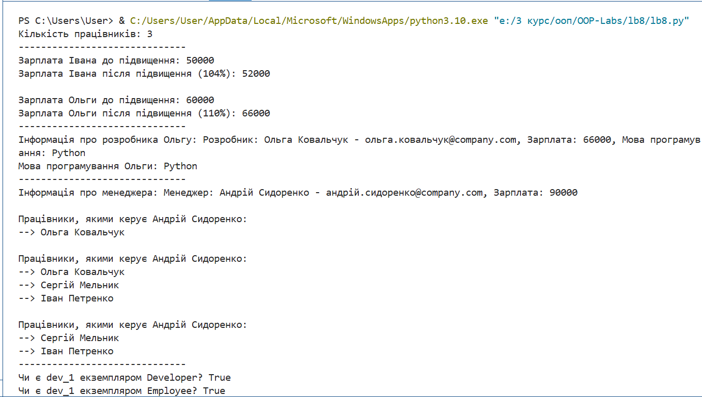

# Лабораторна робота №8
## З дисципліни «Об’єктно-орієнтоване програмування»

**Тема:** «Наслідування в об’єктно-орієнтованому програмуванні»

**Виконала:** студентка групи КН-31з
Рибка Л.Г.

**Перевірив:** Татомир А.В.

Львів 2025

---

## Мета
Опанувати концепцію наслідування класів в Python, навчитися створювати батьківські та дочірні класи, перевикористовувати існуючий код, а також використовувати функцію `super()` для доступу до методів батьківського класу.

## Завдання
1.  Створити базовий клас `Employee`, що містить загальні атрибути та методи для всіх працівників.
2.  Створити дочірні класи `Developer` та `Manager`, які успадковують функціонал від класу `Employee`.
3.  В дочірніх класах модифікувати конструктор, використовуючи функцію `super().__init__()` для коректної ініціалізації батьківського класу.
4.  Перевизначити змінну класу `raise_amount` в класі `Developer` для демонстрації поліморфізму.
5.  Додати унікальний функціонал для `Manager` (список підлеглих) та `Developer` (мова програмування).
6.  Перевірити ієрархію класів за допомогою функцій `isinstance()` та `issubclass()`.

---

## Хід роботи

### 1) Код програми
[Переглянути код](./lb8.py)

### 2) Результат

---

## Висновки
Під час виконання роботи було досягнуто мети: я опанувала концепцію наслідування в Python. На практиці було створено ієрархію класів (`Employee`, `Developer`, `Manager`), де я навчилася перевикористовувати код за допомогою `super().__init__()`. Також було застосовано функції `isinstance()` та `issubclass()` для перевірки відносин між класами та закріплено навички використання Git для версійного контролю.