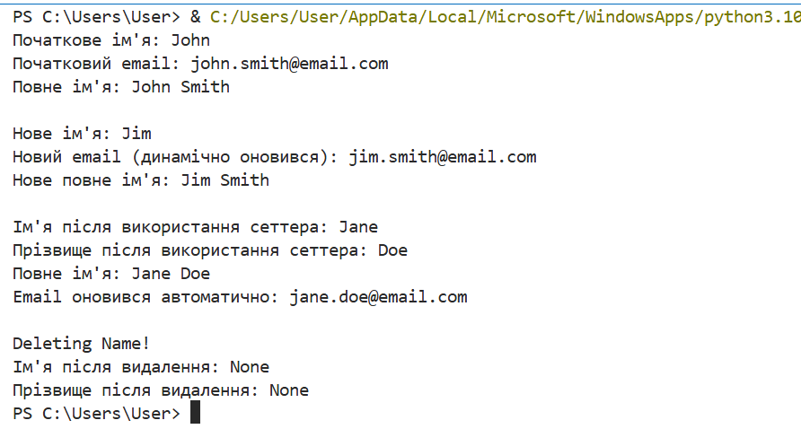

# Лабораторна робота №9
## З дисципліни «Об’єктно-орієнтоване програмування»

**Тема:** «Поліморфізм в Python 3»

**Виконала:** студентка групи КН-31з
Рибка Л.Г.

**Перевірив:** Татомир А.В.

Львів 2025

---

## Мета
Засвоїти застосування принципу поліморфізму в об’єктно-орієнтованому програмуванні.

## Завдання
1.  Створити клас `Employee` з атрибутами `first` та `last`.
2.  Реалізувати `email` та `fullname` як властивості (`@property`), щоб вони динамічно генерувалися.
3.  Реалізувати сеттер (`@fullname.setter`) для `fullname`, який дозволяє змінювати `first` та `last` через присвоєння повного імені.
4.  Реалізувати делетер (`@fullname.deleter`) для `fullname`, який "видаляє" ім'я (встановлює `None`).
5.  Перевірити, що `email` автоматично оновлюється при зміні `first` або `fullname`.

---

## Хід роботи

### 1) Код програми
[Переглянути код](./lb9.py)

### 2) Результат

---

## Висновки
Під час лабораторної роботи я ознайомилася з принципом поліморфізму в Python, закріпила використання властивостей класу (`@property`, сеттер, делетер) для динамічного керування атрибутами об’єкта та навички роботи з Git та GitHub для збереження та публікації коду.